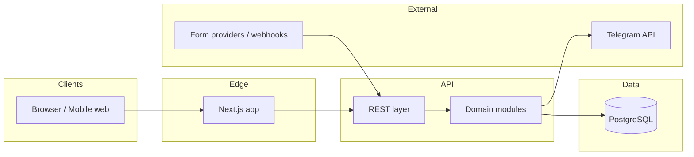

# System

## High-level architecture

- **Modular monolith** with clear domain modules (e.g. leads, students, analytics, integrations, admin).
- **REST API** (JSON) between the Next.js app and the server; single deployable backend service alongside or behind the frontend depending on hosting layout.

## Main components

| Component | Responsibility |
|-----------|----------------|
| **Next.js (React)** | Public landing, authenticated CRM/dashboard/admin UI, server-side fetch where used |
| **Node (Express or NestJS)** | Auth, business rules, REST, integration adapters |
| **PostgreSQL** | Leads, students, users, orgs, events for analytics |
| **Vercel / VPS** | Hosting split as chosen: e.g. Next on Vercel, API + DB on VPS—or combined per cost/ops preference |

## Data flows (conceptual)

1. **Form submit** → validated payload → **Lead** created → optional Telegram notify → appears in CRM and dashboard aggregates.
2. **Status change** in CRM → persisted → **analytics events** updated for reporting.
3. **Admin** changes configuration → cached or read on next request per implementation.

## Non-functional requirements

- **Mobile-first** UI for public and operator flows that matter on the go.
- **Security**: server-side auth, input validation, least-privilege access to data by org/user.
- **Performance**: fast landing for SEO and conversion; sensible image and JS budgets.

## Integration boundaries

- Keep Telegram and form parsers in a dedicated module; map external payloads to internal DTOs to avoid leaking provider quirks across the codebase.

## Future extensions (not committed)

- Additional CRMs via API, paid ads offline imports, calendar booking—document when prioritized.
